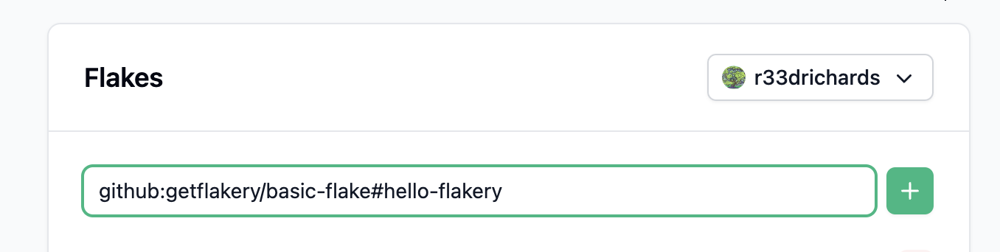
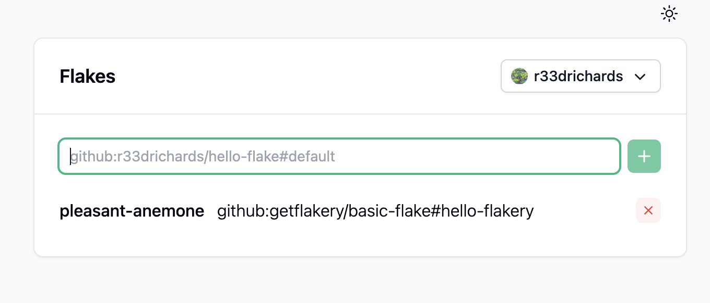
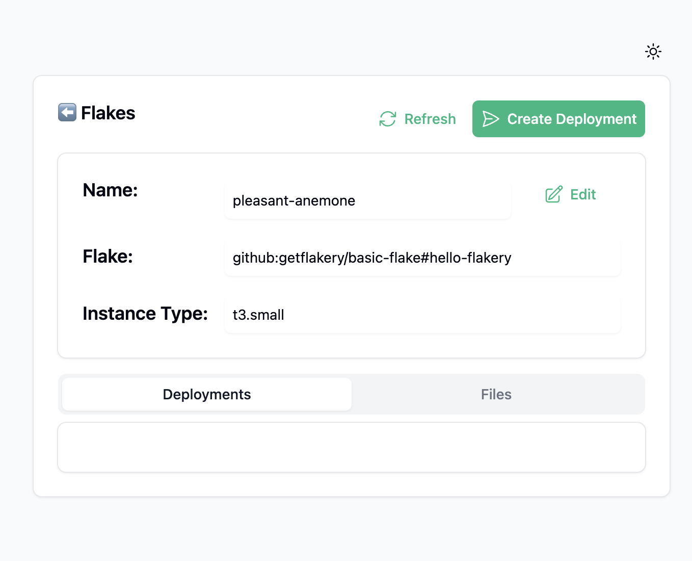
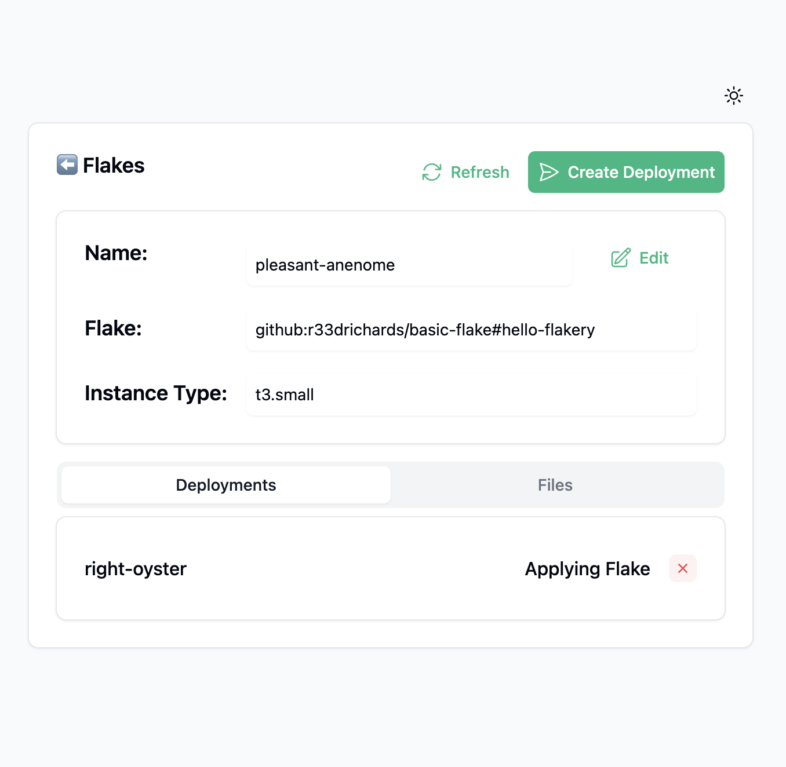
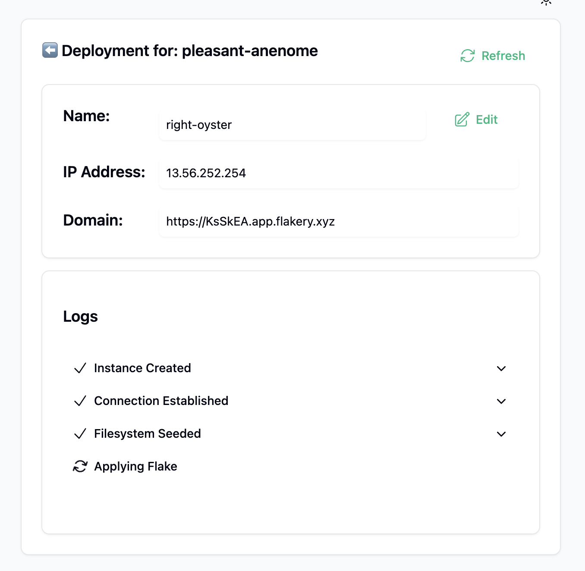

# Create a NixOS Flake and Deploy it on Flakery

In this tutorial, we will create a basic NixOS flake and deploy it on Flakery.

## Prerequisites

Before you begin, you will need to have the following installed:

- [Nix](https://nixos.org/download.html)
- [Nix Flakes](https://nixos.wiki/wiki/Flakes)
- [Git](https://git-scm.com/)

## Create your project directory and initialize a flake

To create a new flake, you can use the `nix flake init` command. This will create a new directory with a `flake.nix` file.

```shell
mkdir basic-flake
cd basic-flake
nix flake init
```

you will now have a `flake.nix` file in your `simple-flake` directory.

```nix 
{
  description = "A very basic flake";

  inputs = {
    nixpkgs.url = "github:nixos/nixpkgs?ref=nixos-unstable";
  };

  outputs = { self, nixpkgs }: {

    packages.x86_64-linux.hello = nixpkgs.legacyPackages.x86_64-linux.hello;

    packages.x86_64-linux.default = self.packages.x86_64-linux.hello;

  };
}
```

first, lets add an input to this flake that will import the `flakery` nixos module.

```nix{6,9}
{
  description = "A very basic flake";

  inputs = {
    nixpkgs.url = "github:nixos/nixpkgs?ref=nixos-unstable";
    flakery.url = "github:getflakery/flakes";  // [!code highlight]
  };

  outputs = { self, nixpkgs, flakery }: { // [!code highlight]

    packages.x86_64-linux.hello = nixpkgs.legacyPackages.x86_64-linux.hello;

    packages.x86_64-linux.default = self.packages.x86_64-linux.hello;

  };
}
```

now we can add the `flakery` module to our flake.


```nix{11-16}
{
  description = "A very basic flake";

  inputs = {
    nixpkgs.url = "github:nixos/nixpkgs?ref=nixos-unstable";
    flakery.url = "github:getflakery/flakery";
  };

  outputs = { self, nixpkgs, flakery }: {

    nixosConfigurations.hello-flakery = nixpkgs.lib.nixosSystem {
      system = "x86_64-linux";
      modules = [
        flakery.nixosModules.flakery
      ];
    };

  };
}
```

now that we have added the `flakery` module to our flake, we can build our system. Lets add a new line to our flake to import a `configuration.nix` file

```nix{15}
{
  description = "A very basic flake";

  inputs = {
    nixpkgs.url = "github:nixos/nixpkgs?ref=nixos-unstable";
    flakery.url = "github:getflakery/flakery";
  };

  outputs = { self, nixpkgs, flakery }: {

    nixosConfigurations.hello-flakery = nixpkgs.lib.nixosSystem {
      system = "x86_64-linux";
      modules = [
        flakery.nixosModules.flakery
        ./configuration.nix
      ];
    };

  };
}
```

now we can create a `configuration.nix` file in our `simple-flake` directory.

```nix
{ config, pkgs, ... }:
let 
  flakeryDomain = builtins.readFile /metadata/flakery-domain;
in
{
  system.stateVersion = "23.05";

  services.caddy = {
    enable = true;
    virtualHosts."${flakeryDomain}".extraConfig = ''
      respond "Hello, world!"
    '';
  }; 
  networking.firewall.allowedTCPPorts = [ 80 443 ];
}
```

<!-- todo explain this file -->

now that we have added a `configuration.nix` file to our flake, we can generate a flake.lock to pin our flake to a specific version of nixpkgs and flakery.

```shell
nix flake lock
```


## Create a git repository and push your flake

Initialize a git repository and create an initial commit. 

```shell
git init
git add .
git commit -m "initial commit"
```

[Create a new repository on GitHub](https://github.com/new) and push your flake to the repository. 

```shell
git branch -M main
git remote add origin git@github.com:getflakery/basic-flake.git
git push -u origin main
```

::: tip
Replace `git@github.com:getflakery/basic-flake.git` with your repository URL.
:::

Now that you have created a flake and pushed it to a git repository, you can deploy it on Flakery.

## Deploy your Nixos Flake on Flakery

To deploy your flake on Flakery, you will need to create a new deployment. You can do this by visiting the [Flakery website](https://flakery.dev/flakes) and adding your flake to the input field. the url should look something like this: `github:$YOUR_USERNAME/basic-flake#hello-flakery`.

::: tip
Replace `$YOUR_USERNAME` with your Github username.
:::



Once you have added your flake, it will appear in the list of available flakes. You can click on the flake to view its details.




Once you have added your flake, you can click the "Create Deployment" button. This will create a new deployment of your flake.



after creating your deployment, you can view the details of your deployment.






After a few minutes, your deployment will be ready. You can then browse to the URL of your deployment to view your NixOS system.


you should see a simple "Hello, world!" page served by Caddy.

