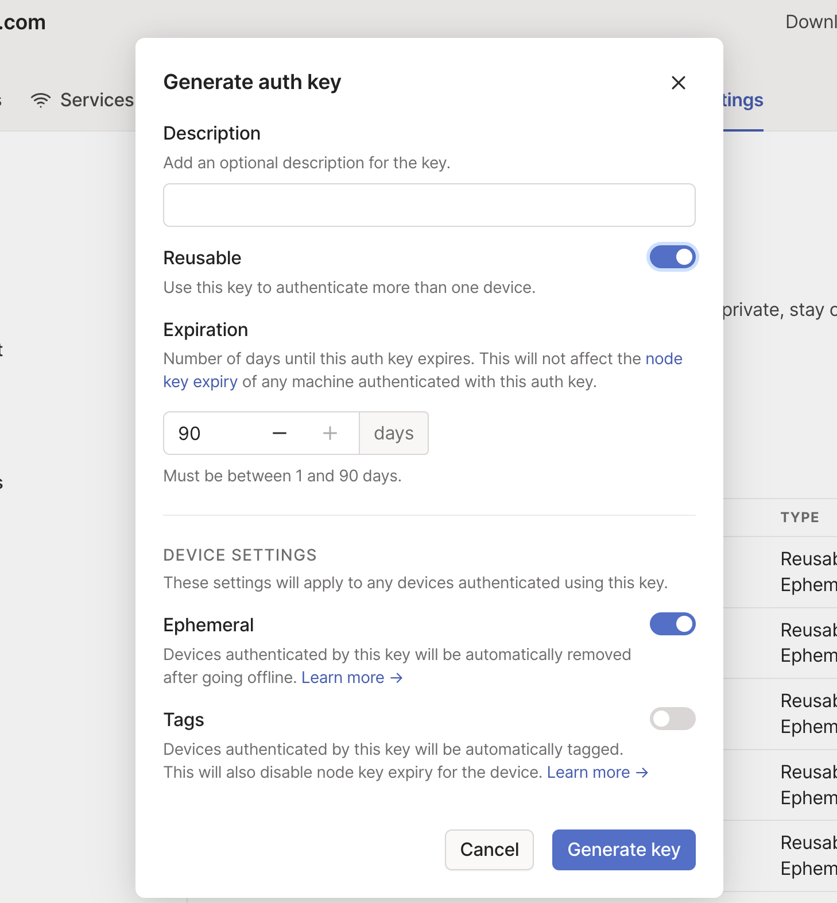
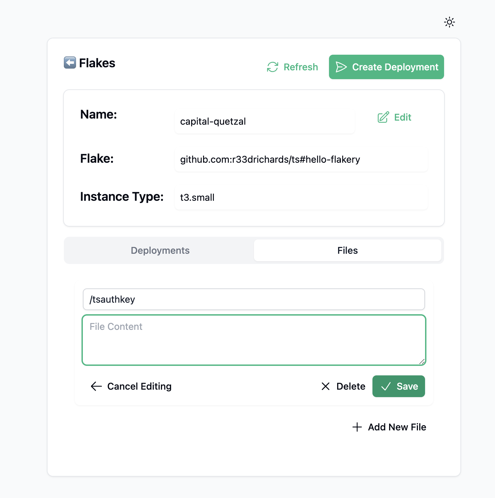
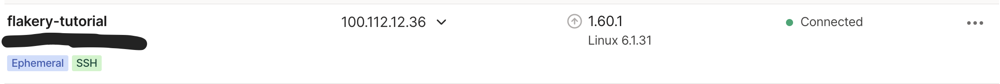

---
---
# Connect to a Flakery Instance via Tailscale

In order to connect to a flakery instance via SSH, we will need to edit the nixos configuration to allow SSH access, and then connect to the instance using the `ssh` command. This guide will walk you through the process of connecting to a flakery instance via SSH, and editing the nixos configuration to allow SSH access.

## Prequisites 

This guide assumes that you already have a nix flake that you would like to connect to via SSH. If you do not have a nix flake, see [Using the Flakery Nix Flake Template](/guides/nix-flake-template) for instructions on how to create a new nix flake using the flakery template. If instead, you'd just like to create one in the current directoy, run the following command:

```sh
nix flake init -t github:getflakery/flakes#flakery
nix flake lock # generate lockfile
```

This guide also assumes that you have a tailscale account and have installed the tailscale client on your local machine. If you do not have a tailscale account, you can sign up for one [here](https://tailscale.com/).

## Edit Your NixOS Configuration to Enable the Tailscale Service

### Enable The Tailscale Service

You can enable the tailscale service by adding the following to your `configuration.nix` file:


```nix{8-12}
{ config, pkgs, ... }:
let 
  flakeryDomain = builtins.readFile /metadata/flakery-domain;
in
{
  system.stateVersion = "23.05";

  services.tailscale = {
    enable = true;
    authKeyFile = "/tsauthkey";
    extraUpFlags = [ "--ssh" "--hostname" "flakery-tutorial" ];
  };

}
```

This enables the tailscale service for nixos, specifies the location of the tailscale authentication key file, and specifies the extra flags to use when bringing up the tailscale service.


## Create a Flakery Template and Deployment. 

Create a flakery template for your nix flake. If you need a refresher, check out the [Creating a Flakery Template](/guides/quick-start/#create-your-deployment-template) section of the quick start guide.


## Add AuthKey to Your Flakery Template

create an auth key on the [tailscale keys page](https://login.tailscale.com/admin/settings/keys).


On the template page, add a file to your template with the `/tsauthkey` path and an auth key from the previous step.
. Then save the file to the template. 

## Deploy the Template 

 Deploy your newly created flakery template. If you need a refresher, check out the [Create Your Deployment](/guides/quick-start/#create-your-deployment) section of the quick start guide.

## View the Flakery Instance in the Tailscale Admin Console and Connect to it via Tailscale SSH

Once your flakery instance is deployed, you can view it in the tailscale admin console and connect to it via tailscale ssh.

