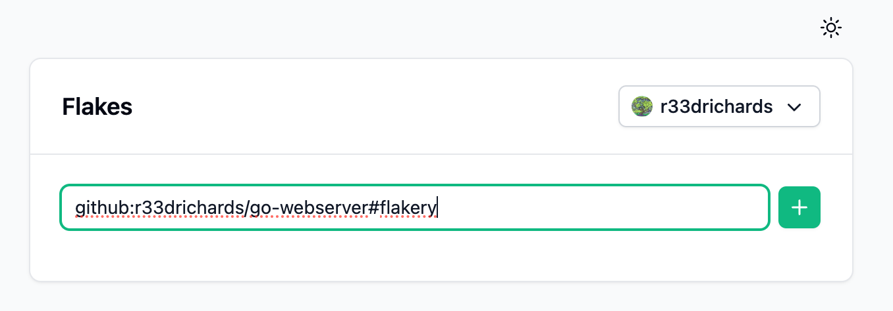
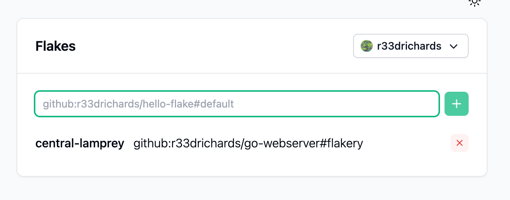
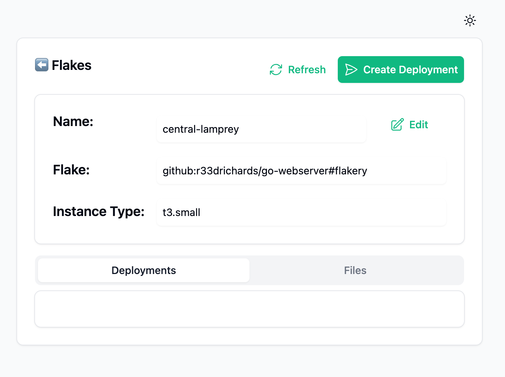
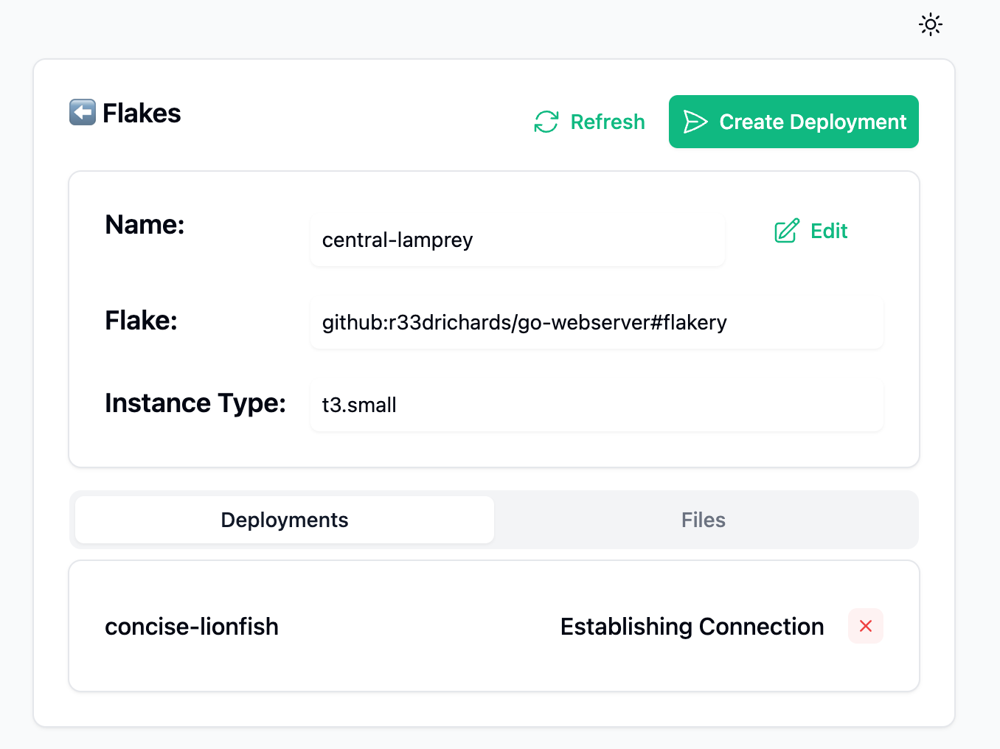
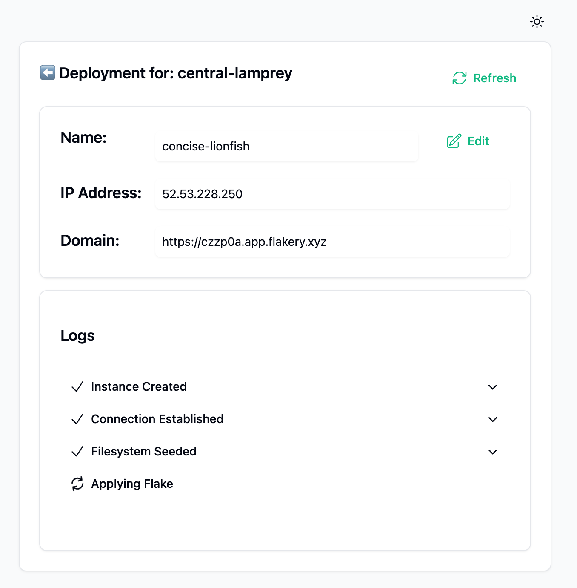
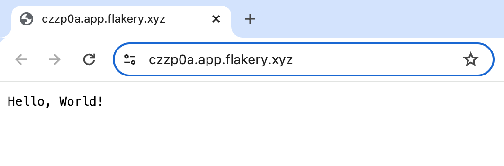

# Deploy a Go Webserver on Flakery

This guide will go over creating a go http server and serving it using flakery. 

## Create a new directory and initialize a new flake

```sh
mkdir go-webserver
cd go-webserver
nix flake init -t github:getflakery/flakes#go-webserver
```

this will add the following files to your directory:

```sh
wrote: /home/alice/go-webserver/gomod2nix.toml
wrote: /home/alice/go-webserver/.envrc
wrote: /home/alice/go-webserver/default.nix
wrote: /home/alice/go-webserver/shell.nix
wrote: /home/alice/go-webserver/flakery.nix
wrote: /home/alice/go-webserver/flake.nix
wrote: /home/alice/go-webserver/.gitignore
wrote: /home/alice/go-webserver/main.go
wrote: /home/alice/go-webserver/go.mod
```

Lets take a moment to examine the files that were created and what they do.

## Project Structure

- the `gomod2nix.toml` file is used to convert the go.mod file to a nix expression. This converts the go dependencies to nix dependencies.

- the `.envrc` file is used to load the nix environment when using direnv. This is useful for setting up the environment for development.

- the `default.nix` file is used to build the go project. This file is used by the `flake.nix` file to build the go project.

- the `shell.nix` file is used to create a nix shell for the go project. This file is used by the `flake.nix` file to create a nix shell for the go project.

- the `flakery.nix` file is used to create a nixos module for the go project. This file is used by the `flake.nix` file to create a nixos module for the go project.

- the `flake.nix` file is used to create a flake for the go project. This file is used by the `flake.nix` file to create a flake for the go project.

- the `.gitignore` file is used to ignore files when using git. This file is used by the `flake.nix` file to ignore files when using git.

- the `main.go` file is used to create the go webserver. This file is used by the `flake.nix` file to create the go webserver.

- the `go.mod` file is used to manage the go dependencies. This file is used by the `flake.nix` file to manage the go dependencies.

## Examining Build Configuration

In the `flake.nix` file in the project root, the go project's derivation is built using the [callPackage](https://nixos.org/guides/nix-pills/callpackage-design-pattern) design pattern. 

#### `flake.nix`
```nix{22-24}
{
  description = "A basic gomod2nix flake";

  inputs.nixpkgs.url = "github:NixOS/nixpkgs/nixos-unstable";
  inputs.flake-utils.url = "github:numtide/flake-utils";
  inputs.gomod2nix.url = "github:nix-community/gomod2nix";
  inputs.gomod2nix.inputs.nixpkgs.follows = "nixpkgs";
  inputs.gomod2nix.inputs.flake-utils.follows = "flake-utils";
  inputs.flakery.url = "github:getflakery/flakes";


  outputs = inputs@{ self, nixpkgs, flake-utils, gomod2nix, flakery }:
    (flake-utils.lib.eachDefaultSystem
      (system:
        let
          pkgs = nixpkgs.legacyPackages.${system};

          # The current default sdk for macOS fails to compile go projects, so we use a newer one for now.
          # This has no effect on other platforms.
          callPackage = pkgs.darwin.apple_sdk_11_0.callPackage or pkgs.callPackage;

          app = callPackage ./. {
            inherit (gomod2nix.legacyPackages.${system}) buildGoApplication;
          };
          appModule = (import ./flakery.nix) app;

        in
        {
          packages.default = app;
          devShells.default = callPackage ./shell.nix {
            inherit (gomod2nix.legacyPackages.${system}) mkGoEnv gomod2nix;
          };

          packages.nixosConfigurations.flakery = nixpkgs.lib.nixosSystem {
            system = system;
            modules = [
              flakery.nixosModules.flakery
              appModule
            ];
          };

        })
    );
}
```

this `app` derivation is then used in two places:

- passed int to the imported `flakery.nix` file to create a nixos module for the go project
- used to create a default build target for this flake

#### `flake.nix`
```nix{25,28}
{
  description = "A basic gomod2nix flake";

  inputs.nixpkgs.url = "github:NixOS/nixpkgs/nixos-unstable";
  inputs.flake-utils.url = "github:numtide/flake-utils";
  inputs.gomod2nix.url = "github:nix-community/gomod2nix";
  inputs.gomod2nix.inputs.nixpkgs.follows = "nixpkgs";
  inputs.gomod2nix.inputs.flake-utils.follows = "flake-utils";
  inputs.flakery.url = "github:getflakery/flakes";


  outputs = inputs@{ self, nixpkgs, flake-utils, gomod2nix, flakery }:
    (flake-utils.lib.eachDefaultSystem
      (system:
        let
          pkgs = nixpkgs.legacyPackages.${system};

          # The current default sdk for macOS fails to compile go projects, so we use a newer one for now.
          # This has no effect on other platforms.
          callPackage = pkgs.darwin.apple_sdk_11_0.callPackage or pkgs.callPackage;

          app = callPackage ./. {
            inherit (gomod2nix.legacyPackages.${system}) buildGoApplication;
          };
          appModule = (import ./flakery.nix) app;
        in
        {
          packages.default = app;
          devShells.default = callPackage ./shell.nix {
            inherit (gomod2nix.legacyPackages.${system}) mkGoEnv gomod2nix;
          };

          packages.nixosConfigurations.flakery = nixpkgs.lib.nixosSystem {
            system = system;
            modules = [
              flakery.nixosModules.flakery
              appModule
            ];
          };

        })
    );
}
```

We can see the result of this default package defined on line 28 by running the command `nix build` in the project root. This will build the go project and create a `result` symlink in the project root. 

```sh
nix build
```

run the result with the following command:

```sh
./result/bin/app
```


If we then examine the `flakery.nix` file, we can see that the `app` derivation is used to create a nixos module for the go project.

#### `flakery.nix`

```nix
app:
{ config, lib, pkgs, ... }:
let
  flakeryDomain = builtins.readFile /metadata/flakery-domain;
in
{
  networking.firewall.allowedTCPPorts = [ 80 443 ];

  systemd.services.go-webserver = {
    description = "go webserver";
    after = [ "network.target" ];
    wantedBy = [ "multi-user.target" ];
    serviceConfig = {
      ExecStart = "${app}/bin/app";
      Restart = "always";
      KillMode = "process";
    };
  };

  services.caddy = {
    enable = true;
    virtualHosts."${flakeryDomain}".extraConfig = ''
      handle /* {
        reverse_proxy http://127.0.0.1:8080
      }
    '';
  };
}
```

This file defines a function that takes an arguement `app` and returns a nixos module. Passing the `app` into `flakery.dev` like this ensures that the same derivation (package) is used when building locally and deploying on flakery. 

The NixOS module we have defined contains a systemd service definition, which will be activated on boot. The service starts our `app` binary defined in our derivation, and the caddy service serves a reverse proxy and SSL certificate for the [flakery domain](/concepts/networking/domains). 


Looking back at our flake.nix we can see that the NixOS module defined by `flakery.nix` used in the definition of the flake level NixOS configuration, called `flakery`. We have also inclued the flakery nixos module `flakery.nixosModules.flakery` to include the necessary boilerplate to configure NixOS to work on flakery. 


#### `flake.nix`

```nix{25,37}
{
  description = "A basic gomod2nix flake";

  inputs.nixpkgs.url = "github:NixOS/nixpkgs/nixos-unstable";
  inputs.flake-utils.url = "github:numtide/flake-utils";
  inputs.gomod2nix.url = "github:nix-community/gomod2nix";
  inputs.gomod2nix.inputs.nixpkgs.follows = "nixpkgs";
  inputs.gomod2nix.inputs.flake-utils.follows = "flake-utils";
  inputs.flakery.url = "github:getflakery/flakes";


  outputs = inputs@{ self, nixpkgs, flake-utils, gomod2nix, flakery }:
    (flake-utils.lib.eachDefaultSystem
      (system:
        let
          pkgs = nixpkgs.legacyPackages.${system};

          # The current default sdk for macOS fails to compile go projects, so we use a newer one for now.
          # This has no effect on other platforms.
          callPackage = pkgs.darwin.apple_sdk_11_0.callPackage or pkgs.callPackage;

          app = callPackage ./. {
            inherit (gomod2nix.legacyPackages.${system}) buildGoApplication;
          };
          appModule = (import ./flakery.nix) app;
        in
        {
          packages.default = app;
          devShells.default = callPackage ./shell.nix {
            inherit (gomod2nix.legacyPackages.${system}) mkGoEnv gomod2nix;
          };

          packages.nixosConfigurations.flakery = nixpkgs.lib.nixosSystem {
            system = system;
            modules = [
              flakery.nixosModules.flakery
              appModule
            ];
          };

        })
    );
}
```

Great! so in this project we have:

- a go http server that we can build using nix
- a nix flake that defines a NixOS configuration that runs that http server 


Now all thats left is creating a git repository and deploying it on Flakery. 


## Create a git repository and push your flake

Initialize a git repository and create an initial commit. 

```shell
git init
git add .
git commit -m "initial commit"
```

[Create a new repository on GitHub](https://github.com/new) and push your flake to the repository. 

```shell
git branch -M main
git remote add origin git@github.com:$YOUR_USERNAME/go-webserver.git
git push -u origin main
```

::: tip
Replace `$YOUR_USERNAME` with your Github username.
:::

Now that you have created a flake and pushed it to a git repository, you can deploy it on Flakery.

## Deploy your NixOS Configuration on Flakery

### Create a Deployment Template 

To deploy a NixOS configuration on Flakery, you need to create a [deployment template](/concepts/deployment-templates/). You can do this by visiting the [Flakery website](https://flakery.dev/flakes) and adding your flake to the input field. the url should look something like this: `github:$YOUR_USERNAME/go-webserver#flakery`.



::: tip
Replace `$YOUR_USERNAME` with your Github username.
:::

You should see your newly created deployment template below.



### Deploy your NixOS Configuration

Click on the deployment template to view its details page.



Click on the `Create Deployment` in the upper right hand corner of the screen to create a deployment of your nix flake.  You should then see a deployment created at the bottom of your screen. 



Click on the the deployment to view its details



after a few minutes, when the flake is finished applying, you can navigate to the domain linked in the deployment details page to view your `Hello World` web server's response. 

